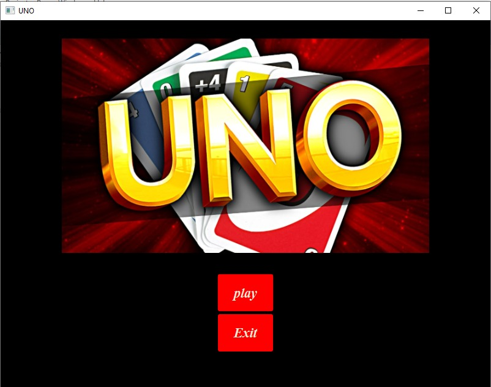
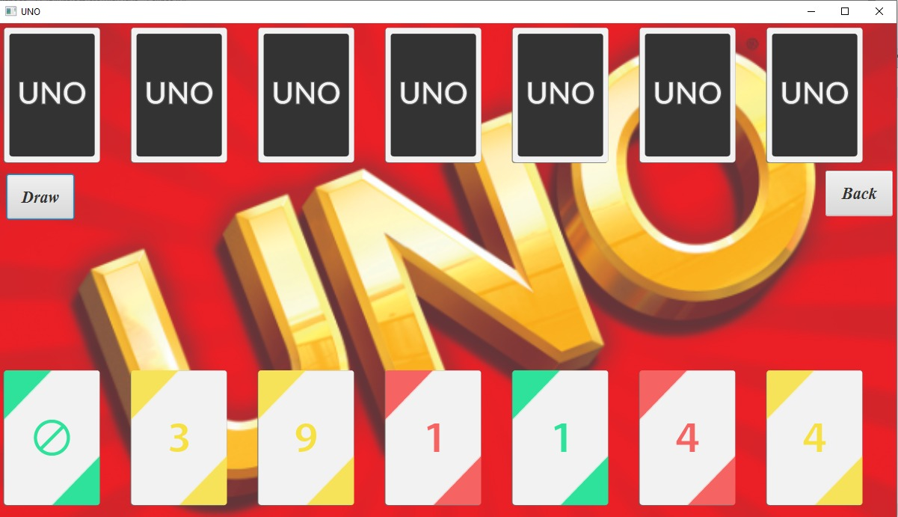
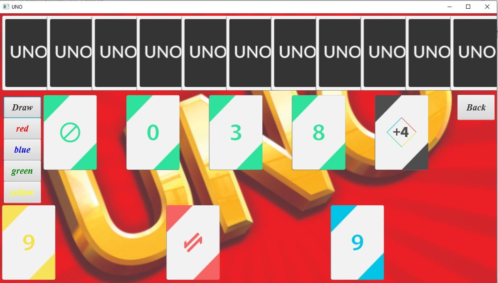

# About The Project
This is my project for advanced programming by java course.   
This is a simple UNO game that applies the universal UNO game roles.  In this game, there is just one player that plays with the computers.
 

**Build with:**
Javafx 8.0.171-b11

# Project Images
 
 

